# 🚀 MiniCloud - Hệ Thống Cloud Đầy Đủ Tính Năng

> **Dự án**: Thiết kế và triển khai hệ thống cloud hoàn chỉnh với Docker  
> **Sinh viên**: 52000054 - 52100098 - 52100989  
> **Môn học**: Điện toán đám mây

---

## 📋 Mục Lục

- [Tổng Quan](#-tổng-quan)
- [Kiến Trúc Hệ Thống](#-kiến-trúc-hệ-thống)
- [Cài Đặt và Triển Khai](#-cài-đặt-và-triển-khai)
- [Kiểm Thử Hệ Thống](#-kiểm-thử-hệ-thống)
- [Kết Quả](#-kết-quả)
- [Tài Liệu Tham Khảo](#-tài-liệu-tham-khảo)

---

## 🌟 Tổng Quan

**MiniCloud** là một hệ thống cloud infrastructure hoàn chỉnh được triển khai bằng Docker, bao gồm đầy đủ các thành phần:

- ✅ **Web Frontend** - Nginx static site
- ✅ **Application Backend** - Node.js/Express API
- ✅ **Database** - MariaDB relational database
- ✅ **Authentication** - Keycloak identity provider
- ✅ **Object Storage** - MinIO S3-compatible storage
- ✅ **DNS Server** - BIND9 internal DNS
- ✅ **Monitoring** - Prometheus + Grafana + Node Exporter
- ✅ **API Gateway** - Nginx reverse proxy

---

## 🏗️ Kiến Trúc Hệ Thống

### Sơ Đồ Kiến Trúc

```
                         ┌─────────────────────────┐
                         │   API Gateway (Port 80) │
                         │    Nginx Reverse Proxy  │
                         └───────────┬─────────────┘
                                     │
            ┌────────────────────────┼────────────────────────┐
            │                        │                        │
    ┌───────▼────────┐    ┌─────────▼────────┐    ┌─────────▼────────┐
    │  Web Frontend  │    │  App Backend API │    │   Keycloak Auth  │
    │  (Port 8080)   │    │   (Port 8085)    │    │   (Port 8081)    │
    └────────────────┘    └──────────────────┘    └──────────────────┘
                                     │
            ┌────────────────────────┼────────────────────────┐
            │                        │                        │
    ┌───────▼────────┐    ┌─────────▼────────┐    ┌─────────▼────────┐
    │   MariaDB      │    │     MinIO        │    │    BIND9 DNS     │
    │  (Port 3306)   │    │  (Port 9000/1)   │    │   (Port 1053)    │
    └────────────────┘    └──────────────────┘    └──────────────────┘

    ┌──────────────────────────────────────────────────────────────────┐
    │                 Monitoring Stack                                 │
    │  Node Exporter (9100) → Prometheus (9090) → Grafana (3000)      │
    └──────────────────────────────────────────────────────────────────┘
```

### Cấu Trúc Thư Mục

```
520000545210098552100989MiniCloud/
├── docker-compose.yml                      # Cấu hình chính
├── web-frontend-server/                    # Web tĩnh
│   ├── Dockerfile
│   ├── conf.default
│   └── html/
│       ├── index.html
│       └── blog/index.html
├── application-backend-server/             # API Backend
│   ├── Dockerfile
│   ├── package.json
│   └── server.js
├── relational-database-server/             # Database
│   └── init/001_init.sql
├── authentication-identity-server/         # Keycloak (image-based)
├── object-storage-server/                  # MinIO
│   └── data/
├── internal-dns-server/                    # BIND9
│   ├── db.cloud.local
│   ├── named.conf
│   ├── named.conf.local
│   └── named.conf.options
├── monitoring-prometheus-server/           # Prometheus
│   └── prometheus.yml
├── monitoring-grafana-dashboard-server/    # Grafana
├── monitoring-node-exporter-server/        # Node Exporter
├── api-gateway-proxy-server/               # Nginx Proxy
│   └── nginx.conf
└── test-network-detailed.sh                # Script test chi tiết
```

---

## 🚀 Cài Đặt và Triển Khai

### Yêu Cầu Hệ Thống

- Docker Engine 20.10+
- Docker Compose 2.0+
- RAM: Tối thiểu 4GB (khuyến nghị 8GB)
- Disk: Tối thiểu 10GB trống

### Bước 1: Clone Repository

```bash
git clone https://github.com/pp7803/DTDM.git
cd DTDM/520000545210098552100989MiniCloud
```

### Bước 2: Build và Khởi Động

```bash
# Build images (không dùng cache)
docker compose build --no-cache

# Khởi động tất cả services
docker compose up -d

# Kiểm tra trạng thái
docker compose ps
```


### Bước 3: Xác Minh Triển Khai

```bash
# Kiểm tra logs
docker compose logs -f

# Kiểm tra network
docker network inspect cloud-net
```

---

## 🧪 Kiểm Thử Hệ Thống

### 1️⃣ Web Frontend Server (Nginx)

**Kiểm tra qua Terminal:**

```bash
curl -I http://localhost:8080/
```


**Kiểm tra qua Trình duyệt:**

- Trang chủ: http://localhost:8080/


- Blog: http://localhost:8080/blog


---

### 2️⃣ Application Backend Server (Node.js)

**Endpoint trực tiếp:**

```bash
curl http://localhost:8085/hello
```


**Endpoint qua API Gateway:**

```bash
curl http://localhost/api/hello
```


---

### 3️⃣ Relational Database Server (MariaDB)

**Kiểm tra kết nối và dữ liệu:**

```bash
docker run -it --rm --network cloud-net -e MYSQL_PWD=root mysql:8 \
  sh -lc 'mysql -h relational-database-server -uroot -e "USE minicloud; SHOW TABLES; SELECT * FROM notes;"'
```


---

### 4️⃣ Authentication Identity Server (Keycloak)

**Truy cập Keycloak Admin Console:**

- URL: http://localhost:8081
- Username: `admin`
- Password: `admin`


**Tạo User Mới (SvTest01):**


---

### 5️⃣ Object Storage Server (MinIO)

**Truy cập MinIO Console:**

- URL: http://localhost:9001
- Username: `minioadmin`
- Password: `minioadmin`


**Tạo Bucket:**


**Upload File:**


---

### 6️⃣ Internal DNS Server (BIND9)

**Kiểm tra DNS resolution:**

```bash
dig @127.0.0.1 -p 1053 web-frontend-server.cloud.local +short
```

**Kỳ vọng:** Trả về IP `10.10.10.10`


---

### 7️⃣ Monitoring - Prometheus

**Truy cập Prometheus:**

- URL: http://localhost:9090
- Kiểm tra: Status → Targets


**Thử Query:**

Query: `node_cpu_seconds_total`


---

### 8️⃣ Monitoring - Grafana Dashboard

**Đăng nhập Grafana:**

- URL: http://localhost:3000
- Username: `admin`
- Password: `admin`


**Thêm Data Source:**

- Type: Prometheus
- URL: `http://prometheus:9090`


**Import Dashboard (Node Exporter Full - ID: 1860):**


---

### 9️⃣ API Gateway Proxy Server (Nginx)

**Kiểm tra routing qua proxy:**

```bash
# Web route
curl -I http://localhost/

# API route
curl -s http://localhost/api/hello

# Auth route
curl -I http://localhost/auth/
```

**Kỳ vọng:**

- `/` → 200 OK (web)
- `/api/hello` → JSON từ backend
- `/auth/` → 302 redirect đến Keycloak


---

### 🔟 Kiểm Tra Kết Nối Mạng (Network Connectivity)

**Ping tất cả services trong mạng:**

```bash
docker run --rm --network cloud-net \
  -v "$(pwd)/test-network-detailed.sh:/test.sh:ro" \
  alpine:latest sh /test.sh 2>&1 | head -50
```


---

## 📊 Kết Quả

### Bảng Tổng Hợp Services

| Service             | Port      | Status     | URL                               |
| ------------------- | --------- | ---------- | --------------------------------- |
| Web Frontend        | 8080      | ✅ Running | http://localhost:8080             |
| Application Backend | 8085      | ✅ Running | http://localhost:8085             |
| MariaDB             | 3306      | ✅ Running | `relational-database-server:3306` |
| Keycloak            | 8081      | ✅ Running | http://localhost:8081             |
| MinIO               | 9000/9001 | ✅ Running | http://localhost:9001             |
| BIND9 DNS           | 1053      | ✅ Running | `127.0.0.1:1053`                  |
| Node Exporter       | 9100      | ✅ Running | http://localhost:9100             |
| Prometheus          | 9090      | ✅ Running | http://localhost:9090             |
| Grafana             | 3000      | ✅ Running | http://localhost:3000             |
| API Gateway         | 80        | ✅ Running | http://localhost                  |

### Các Tính Năng Đã Triển Khai

✅ **Frontend & Backend API**

- Web tĩnh với Nginx
- RESTful API với Node.js/Express
- JWT authentication support

✅ **Database & Storage**

- Relational database (MariaDB)
- Object storage (MinIO S3-compatible)
- Database initialization scripts

✅ **Security & Identity**

- Keycloak OIDC authentication
- User management
- JWT token verification

✅ **Infrastructure**

- Internal DNS resolution (BIND9)
- API Gateway with routing
- Docker network isolation

✅ **Monitoring & Observability**

- Metrics collection (Prometheus)
- Visualization (Grafana)
- System metrics (Node Exporter)

---

## � Mở Rộng Hệ Thống (5 Điểm)

### 1️⃣ Web Frontend Server - Blog Cá Nhân

**Mục tiêu:** Hiểu cách triển khai website tĩnh, quản lý nội dung, và cấu trúc thư mục web.

#### 📝 Nội Dung Mở Rộng

Đã tạo **blog cá nhân** với 3 bài viết chuyên nghiệp về công nghệ:

1. **🐳 Docker và Containerization** (`blog1.html`)

   - Giới thiệu về Docker và containerization
   - Lợi ích và best practices
   - Ứng dụng trong MiniCloud project

2. **🏗️ Kiến Trúc Microservices** (`blog2.html`)

   - Định nghĩa và đặc điểm microservices
   - Ưu điểm và thách thức
   - Kiến trúc MiniCloud với 10 services

3. **📊 Monitoring & Observability** (`blog3.html`)
   - Three pillars of observability
   - Prometheus + Grafana monitoring stack
   - Alerting best practices và SRE principles

#### ✨ Tính Năng

- ✅ Responsive design với gradient backgrounds
- ✅ Navigation links giữa các trang
- ✅ Featured icons và color themes riêng cho mỗi bài
- ✅ Tags và metadata (tác giả, ngày đăng, thời gian đọc)
- ✅ Highlight boxes cho nội dung quan trọng
- ✅ Code examples và architecture diagrams
- ✅ Footer với links quay lại

#### 🎨 Cấu Trúc Files

```
web-frontend-server/html/blog/
├── index.html          # Trang danh sách blog (đã cập nhật)
├── blog1.html          # Bài viết về Docker (mới)
├── blog2.html          # Bài viết về Microservices (mới)
└── blog3.html          # Bài viết về Monitoring (mới)
```

#### 🧪 Kiểm Thử

**1. Rebuild container với nội dung mới:**

```bash
cd 520000545210098552100989MiniCloud
docker compose build web-frontend-server
docker compose up -d web-frontend-server
```

**2. Truy cập blog:**

- Trang blog: http://localhost:8080/blog/
- Bài 1: http://localhost:8080/blog/blog1.html
- Bài 2: http://localhost:8080/blog/blog2.html
- Bài 3: http://localhost:8080/blog/blog3.html

**3. Test qua API Gateway:**

```bash
curl -I http://localhost/blog/
```

#### 🎓 Kiến Thức Đạt Được

✅ **Web Hosting:** Hiểu cách Nginx serve static content từ filesystem

✅ **Cấu Trúc Thư Mục:** Tổ chức files HTML trong directory structure

✅ **Nginx Alias:** Cấu hình location blocks để map URLs → filesystem paths

✅ **HTML/CSS:** Thiết kế responsive web pages với modern CSS (flexbox, grid)

✅ **Content Management:** Quản lý và liên kết nhiều pages trong một website

✅ **Docker Volumes:** Hiểu cách mount local files vào container

#### 📸 Screenshots


_Bài viết về Docker và Containerization_


_Bài viết về Kiến trúc Microservices_


_Bài viết về Monitoring & Observability_

---

### 2️⃣ Application Backend Server - REST API Students

**Mục tiêu:** Làm quen với microservice, REST API, và HTTP JSON response.

#### 📝 Nội Dung Mở Rộng

Đã bổ sung **API endpoint mới** để quản lý thông tin sinh viên:

**Endpoint:** `GET /student`  
**Response:** JSON array chứa danh sách 5 sinh viên

#### 🎯 Implementation Details

**1. File `students.json` (5 sinh viên):**

```json
[
  {
    "id": "52000054",
    "name": "Nguyên Hạnh",
    "major": "Khoa học Máy tính",
    "gpa": 3.75,
    "email": "nguyenhanh@student.uit.edu.vn",
    "year": 3
  },
  {
    "id": "52100985",
    "name": "Duy Phát",
    "major": "Công nghệ Thông tin",
    "gpa": 3.82,
    "email": "duyphat@student.uit.edu.vn",
    "year": 3
  },
  {
    "id": "52100989",
    "name": "Văn Phú",
    "major": "Hệ thống Thông tin",
    "gpa": 3.68,
    "email": "vanphu@student.uit.edu.vn",
    "year": 3
  }
  // ... + 2 sinh viên khác
]
```

**2. Route trong `server.js` (Express/Node.js):**

```javascript
import { readFileSync } from "fs";

app.get("/student", (_req, res) => {
  try {
    const data = readFileSync("./students.json", "utf8");
    const students = JSON.parse(data);
    res.json({
      success: true,
      count: students.length,
      data: students,
    });
  } catch (error) {
    res.status(500).json({
      success: false,
      error: "Failed to read student data",
    });
  }
});
```

**3. Updated `Dockerfile`:**

```dockerfile
FROM node:20-alpine
WORKDIR /app
COPY package.json ./
RUN npm install --omit=dev
COPY server.js ./
COPY students.json ./    # ← Thêm dòng này
EXPOSE 8081
CMD ["node","server.js"]
```

#### 🧪 Kiểm Thử

**1. Rebuild container:**

```bash
cd 520000545210098552100989MiniCloud

# Build image mới
docker compose build application-backend-server

# Stop và remove container cũ
docker compose stop application-backend-server
docker compose rm -f application-backend-server

# Start lại
docker compose up -d application-backend-server

# Check logs
docker compose logs -f application-backend-server
```

**2. Test API endpoint:**

```bash
# Test trực tiếp (port 8085)
curl http://localhost:8085/student

# Test qua API Gateway (port 80)
curl http://localhost/api/student

# Test với pretty JSON
curl -s http://localhost/api/student | jq

# Test với headers
curl -i http://localhost/api/student
```

**3. Expected Response:**

```json
{
  "success": true,
  "count": 5,
  "data": [
    {
      "id": "52000054",
      "name": "Nguyên Hạnh",
      "major": "Khoa học Máy tính",
      "gpa": 3.75,
      "email": "nguyenhanh@student.uit.edu.vn",
      "year": 3
    }
    // ... 4 sinh viên khác
  ]
}
```

#### 🎓 Kiến Thức Đạt Được

✅ **REST API Design:** Hiểu cách thiết kế RESTful endpoints (GET, POST, PUT, DELETE)

✅ **HTTP Methods & Status Codes:** Phân biệt các HTTP methods và response codes (200, 404, 500)

✅ **JSON Data Format:** Serialize/deserialize JSON data trong Node.js

✅ **File System Operations:** Đọc file từ filesystem trong container

✅ **Error Handling:** Implement try-catch và trả về error responses

✅ **Microservice Communication:** Expose internal service qua reverse proxy

✅ **Docker Build Context:** Hiểu cách COPY files vào container image

#### � Screenshots


_Test endpoint trực tiếp qua port 8085_


_Test endpoint qua API Gateway (port 80)_

#### 🔄 API Gateway Routing

API Gateway (Nginx) đã được cấu hình để route requests:

```nginx
location /api/ {
  proxy_pass http://application-backend-server:8081/;
}
```

---

### 3️⃣ Relational Database Server - Student Database & CRUD

**Mục tiêu:** Hiểu về lưu trữ quan hệ (RDBMS), thiết kế schema, và thực hiện CRUD operations.

#### 📝 Nội Dung Mở Rộng

Đã tạo **cơ sở dữ liệu studentdb** với bảng `students` đầy đủ thông tin sinh viên.

#### 🗄️ Database Schema

**Database:** `studentdb`  
**Table:** `students`

```sql
CREATE TABLE students (
    id INT PRIMARY KEY AUTO_INCREMENT,
    student_id VARCHAR(10) UNIQUE NOT NULL,
    fullname VARCHAR(100) NOT NULL,
    dob DATE NOT NULL,
    major VARCHAR(50) NOT NULL,
    gpa DECIMAL(3,2) DEFAULT 0.00,
    email VARCHAR(100),
    phone VARCHAR(15),
    address VARCHAR(200),
    created_at TIMESTAMP DEFAULT CURRENT_TIMESTAMP,
    updated_at TIMESTAMP DEFAULT CURRENT_TIMESTAMP ON UPDATE CURRENT_TIMESTAMP,
    INDEX idx_student_id (student_id),
    INDEX idx_major (major)
);
```

#### 📊 Sample Data (5 sinh viên)

| ID  | Student ID | Fullname    | Major              | GPA  | Email                          |
| --- | ---------- | ----------- | ------------------ | ---- | ------------------------------ |
| 1   | 52000054   | Nguyên Hạnh | Khoa học Máy tính  | 3.75 | nguyenhanh@student.tdtu.edu.vn |
| 2   | 52100985   | Duy Phát    | Mạng Máy tính      | 3.82 | duyphat@student.tdtu.edu.vn    |
| 3   | 52100989   | Văn Phú     | Hệ thống Thông tin | 3.68 | vanphu@student.tdtu.edu.vn     |
| 4   | 52100123   | Minh Tuấn   | Kỹ thuật Phần mềm  | 3.90 | minhtuan@student.tdtu.edu.vn   |
| 5   | 52000456   | Thu Hà      | An toàn Thông tin  | 3.55 | thuha@student.tdtu.edu.vn      |

#### 🔧 CRUD Operations

**1. CREATE - Thêm sinh viên mới:**

```sql
INSERT INTO students (student_id, fullname, dob, major, gpa, email, phone, address)
VALUES ('52100999', 'Anh Khoa', '2002-09-15', 'Trí tuệ Nhân tạo', 3.65,
        'anhkhoa@student.tdtu.edu.vn', '0907890123', 'TP. Hồ Chí Minh');
```

**2. READ - Đọc dữ liệu:**

```sql
-- Lấy tất cả sinh viên
SELECT * FROM students;

-- Lấy sinh viên theo ID
SELECT * FROM students WHERE student_id = '52000054';

-- Lấy sinh viên theo major
SELECT * FROM students WHERE major = 'Khoa học Máy tính';

-- Lấy sinh viên có GPA > 3.7
SELECT * FROM students WHERE gpa > 3.7 ORDER BY gpa DESC;

-- Thống kê theo major
SELECT major, COUNT(*) as total, AVG(gpa) as avg_gpa
FROM students GROUP BY major;
```

**3. UPDATE - Cập nhật dữ liệu:**

```sql
-- Cập nhật GPA
UPDATE students SET gpa = 3.85 WHERE student_id = '52000054';

-- Cập nhật nhiều fields
UPDATE students
SET email = 'newemail@student.tdtu.edu.vn', phone = '0901111111'
WHERE student_id = '52100985';

-- Cập nhật major
UPDATE students SET major = 'Data Science' WHERE id = 4;
```

**4. DELETE - Xóa dữ liệu:**

```sql
-- Xóa theo student_id
DELETE FROM students WHERE student_id = '52100999';

-- Xóa sinh viên có GPA thấp (cẩn thận!)
DELETE FROM students WHERE gpa < 2.0;

-- Xóa tất cả (KHÔNG khuyến khích!)
-- DELETE FROM students;
```

#### 🧪 Kiểm Thử

**1. Database đã được tạo tự động khi start container:**

```bash
# File init được mount: relational-database-server/init/002_studentdb.sql
docker compose logs relational-database-server | grep studentdb
```

**2. Connect và test CRUD:**

```bash
# SELECT - Xem tất cả sinh viên
docker run -it --rm --network cloud-net -e MYSQL_PWD=root mysql:8 \
  sh -lc 'mysql -h relational-database-server -uroot -e "USE studentdb; SELECT * FROM students;"'

# INSERT - Thêm sinh viên mới
docker run -it --rm --network cloud-net -e MYSQL_PWD=root mysql:8 \
  sh -lc 'mysql -h relational-database-server -uroot -e "USE studentdb;
  INSERT INTO students (student_id, fullname, dob, major, gpa)
  VALUES (\"52100999\", \"Test Student\", \"2002-01-01\", \"Testing\", 3.50);"'

# UPDATE - Cập nhật GPA
docker run -it --rm --network cloud-net -e MYSQL_PWD=root mysql:8 \
  sh -lc 'mysql -h relational-database-server -uroot -e "USE studentdb;
  UPDATE students SET gpa = 3.95 WHERE student_id = \"52000054\";"'

# DELETE - Xóa sinh viên test
docker run -it --rm --network cloud-net -e MYSQL_PWD=root mysql:8 \
  sh -lc 'mysql -h relational-database-server -uroot -e "USE studentdb;
  DELETE FROM students WHERE student_id = \"52100999\";"'
```

**3. Interactive shell (MySQL CLI):**

```bash
# Connect vào MySQL shell
docker run -it --rm --network cloud-net -e MYSQL_PWD=root mysql:8 \
  mysql -h relational-database-server -uroot

# Trong shell:
USE studentdb;
SHOW TABLES;
DESCRIBE students;
SELECT * FROM students;
```

#### 🎓 Kiến Thức Đạt Được

✅ **Database Design:** Thiết kế schema với primary key, indexes, constraints

✅ **Data Types:** Hiểu các kiểu dữ liệu (INT, VARCHAR, DATE, DECIMAL, TIMESTAMP)

✅ **CRUD Operations:** Thực hành INSERT, SELECT, UPDATE, DELETE

✅ **SQL Queries:** Viết queries với WHERE, ORDER BY, GROUP BY, JOIN

✅ **Database Normalization:** Tổ chức dữ liệu theo chuẩn (1NF, 2NF, 3NF)

✅ **Docker Volumes:** Hiểu cách persist database data qua volumes

✅ **Init Scripts:** Tự động khởi tạo database khi container start

✅ **Connection String:** Connect từ application tới database server

#### 📸 Screenshots


_Query SELECT lấy danh sách sinh viên_


_INSERT thêm sinh viên mới_


_UPDATE cập nhật GPA sinh viên_

#### 🔗 Connect từ Backend

**Cài đặt MySQL driver cho Node.js:**

```bash
npm install mysql2
```

**Thêm vào `server.js`:**

```javascript
import mysql from "mysql2/promise";

// Create connection pool
const pool = mysql.createPool({
  host: "relational-database-server",
  user: "root",
  password: "root",
  database: "studentdb",
  waitForConnections: true,
  connectionLimit: 10,
});

// API endpoint to get students from DB
app.get("/students/db", async (_req, res) => {
  try {
    const [rows] = await pool.query("SELECT * FROM students ORDER BY gpa DESC");
    res.json({
      success: true,
      source: "database",
      count: rows.length,
      data: rows,
    });
  } catch (error) {
    res.status(500).json({
      success: false,
      error: error.message,
    });
  }
});
```


_UPDATE Kết nối + trả dữ liệu từ DB_

#### 💾 Data Persistence

Database data được lưu trong Docker volume, không bị mất khi restart container:

```bash
# Xem volumes
docker volume ls | grep database

# Inspect volume
docker volume inspect [volume-name]

# Backup database
docker compose exec relational-database-server \
  mysqldump -uroot -proot studentdb > backup.sql

# Restore database
docker compose exec -T relational-database-server \
  mysql -uroot -proot studentdb < backup.sql
```

### 4️⃣ Authentication Identity Server - Keycloak SSO & OIDC

**Mục tiêu:** Làm quen với Identity Provider (IdP), Single Sign-On (SSO), và OAuth2/OIDC flow.

#### 📝 Nội Dung Mở Rộng

Cấu hình **Keycloak** với Realm mới, users, và client application để implement authentication flow.

#### 🔐 Keycloak Configuration

**1. Truy cập Keycloak Admin Console:**

```
URL: http://localhost:8081
Username: admin
Password: admin
```


_Đăng nhập Keycloak Admin Console_

---

#### 🏰 Bước 1: Tạo Realm Mới

**1. Click dropdown "master" ở góc trên bên trái**

**2. Click "Create Realm"**

**3. Điền thông tin:**

- **Realm name:** `realm_520000545210098552100989` (theo mã sinh viên)
- **Enabled:** ON
- Click **Create**


_Tạo Realm mới theo mã sinh viên_

**Kết quả:** Realm `realm_520000545210098552100989` được tạo và active.

---

#### 👥 Bước 2: Tạo Users

**1. Trong Realm `realm_520000545210098552100989`, click menu "Users" (sidebar trái)**

**2. Click "Add user"**

**User 1: sv01**

- **Username:** `sv01`
- **Email:** `sv01@student.tdtu.edu.vn`
- **First name:** `Sinh viên`
- **Last name:** `01`
- **Email verified:** ON
- Click **Create**

**Sau khi tạo, set password:**

- Click tab "Credentials"
- Click "Set password"
- **Password:** `sv01password`
- **Password confirmation:** `sv01password`
- **Temporary:** OFF (để user không phải đổi password lần đầu)
- Click **Save**


_Tạo user sv01 với thông tin đầy đủ_

**User 2: sv02** (làm tương tự)

- **Username:** `sv02`
- **Email:** `sv02@student.tdtu.edu.vn`
- **First name:** `Sinh viên`
- **Last name:** `02`
- **Password:** `sv02password`
- **Temporary:** OFF

_Tạo user sv02_

**Kết quả:** 2 users (sv01, sv02) được tạo và có thể login.

---

#### 🔧 Bước 3: Tạo Client Application

**1. Click menu "Clients" (sidebar trái)**

**2. Click "Create client"**

**3. General Settings:**

- **Client type:** `OpenID Connect`
- **Client ID:** `nodejs-app`
- Click **Next**

**4. Capability config:**

- **Client authentication:** OFF (public client)
- **Authorization:** OFF
- **Authentication flow:**
  - ✅ Standard flow
  - ✅ Direct access grants
  - ❌ Implicit flow
- Click **Next**

**5. Login settings:**

- **Root URL:** `http://localhost:8085`
- **Home URL:** `http://localhost:8085`
- **Valid redirect URIs:**
  - `http://localhost:8085/*`
  - `http://localhost/api/*`
- **Web origins:** `*`
- Click **Save**


_Tạo client nodejs-app với Access Type: public_

**Kết quả:** Client `nodejs-app` được tạo và có thể nhận tokens.

---

#### 🔑 Bước 4: Lấy Token và Test /secure Endpoint

**1. Lấy Token Endpoint URL:**

Trong client `nodejs-app`, click tab "Details" hoặc vào:

```
Realm Settings → General → Endpoints → OpenID Endpoint Configuration
```

**Token Endpoint:**

```
http://localhost:8081/realms/realm_520000545210098552100989/protocol/openid-connect/token
```

**2. Lấy Access Token (qua curl):**

```bash
# Lấy token với user sv01
curl -X POST http://localhost:8081/realms/realm_520000545210098552100989/protocol/openid-connect/token \
  -H "Content-Type: application/x-www-form-urlencoded" \
  -d "client_id=nodejs-app" \
  -d "username=sv01" \
  -d "password=sv01password" \
  -d "grant_type=password"
```

**Response sẽ có:**

```json
{
  "access_token": "eyJhbGciOiJSUzI1NiIsInR5cCI6IkpXVCJ9...",
  "token_type": "Bearer",
  "expires_in": 300,
  "refresh_token": "eyJhbGciOiJIUzI1NiIsInR5cCI6IkpXVCJ9...",
  "scope": "profile email"
}
```


_Lấy access token qua Password Grant flow_

## Cách Khắc Phục Lỗi Account is not fully set up (nếu có)

Bước 1: Truy cập Keycloak Admin
Bước 2: Kiểm tra và Fix User sv01

1. Vào realm realm_520000545210098552100989

2. Click menu "Users" → Tìm user sv01

3. Click vào user sv01

4. Trong tab "Details":

✅ Enabled: ON
✅ Email verified: ON
Click Save 5. Trong tab "Credentials":

Kiểm tra password đã được set
Temporary: phải là OFF
Nếu chưa có password, click "Set password" và set lại:
Password: sv01password
Password confirmation: sv01password
Temporary: OFF
Click Save password 6. Trong tab "Required actions":

Xóa tất cả required actions (nếu có)
List phải trống
Click Save nếu có thay đổi

**3. Test /secure endpoint với token:**

```bash
# Lưu token vào biến
TOKEN="eyJhbGciOiJSUzI1NiIsInR5cCI6IkpXVCJ9..."

# Test endpoint /secure
curl -H "Authorization: Bearer $TOKEN" \
  http://localhost:8085/secure
```

**Expected Response:**

```json
{
  "message": "Secure OK",
  "user": "sv01"
}
```


_Test /secure endpoint với Bearer token thành công_

**4. Test qua API Gateway:**

```bash
curl -H "Authorization: Bearer $TOKEN" \
  http://localhost/api/secure
```


_Test /secure endpoint với Bearer token thành công_

---

#### 🎓 Kiến Thức Đạt Được

✅ **Identity Provider (IdP):** Hiểu vai trò của Keycloak như centralized authentication service

✅ **Realm Concept:** Tổ chức users, clients, roles trong isolated realms

✅ **OAuth2/OIDC Flow:** Understand authorization code flow và password grant flow

✅ **Access Token:** JWT token chứa user claims, được verify bởi backend

✅ **Token Endpoint:** URL để request tokens với credentials

✅ **Client Types:** Public vs Confidential clients và use cases

✅ **Single Sign-On (SSO):** Một lần login → access nhiều applications

✅ **JWT Verification:** Backend verify token signature với JWKS endpoint

#### 🔄 Update Backend để sử dụng Realm mới

**Cập nhật `docker-compose.yml`:**

```yaml
application-backend-server:
  environment:
    OIDC_ISSUER: "http://authentication-identity-server:8080/realms/realm_520000545210098552100989"
    OIDC_AUDIENCE: "nodejs-app"
```

**Restart backend:**

```bash
docker compose restart application-backend-server
```

---

#### 🧪 Complete Test Flow

**1. Start Keycloak và Backend:**

```bash
docker compose up -d authentication-identity-server application-backend-server
```

**2. Get token:**

```bash
TOKEN=$(curl -s -X POST \
  http://localhost:8081/realms/realm_520000545210098552100989/protocol/openid-connect/token \
  -H "Content-Type: application/x-www-form-urlencoded" \
  -d "client_id=nodejs-app" \
  -d "username=sv01" \
  -d "password=sv01password" \
  -d "grant_type=password" | jq -r .access_token)

echo "Token: $TOKEN"
```

**3. Test protected endpoint:**

```bash
curl -H "Authorization: Bearer $TOKEN" http://localhost:8085/secure
curl -H "Authorization: Bearer $TOKEN" http://localhost/api/secure
```

**4. Test với user sv02:**

```bash
TOKEN_SV02=$(curl -s -X POST \
  http://localhost:8081/realms/realm_520000545210098552100989/protocol/openid-connect/token \
  -H "Content-Type: application/x-www-form-urlencoded" \
  -d "client_id=nodejs-app" \
  -d "username=sv02" \
  -d "password=sv02password" \
  -d "grant_type=password" | jq -r .access_token)

curl -H "Authorization: Bearer $TOKEN_SV02" http://localhost:8085/secure
```

---

#### 🔍 Debug & Troubleshooting

**1. Check Keycloak logs:**

```bash
docker compose logs -f authentication-identity-server
```

**2. Verify token (decode JWT):**

```bash
# Sử dụng jwt.io hoặc decode locally
echo $TOKEN | cut -d. -f2 | base64 -d 2>/dev/null | jq
```

**3. Check JWKS endpoint:**

```bash
curl http://localhost:8081/realms/realm_520000545210098552100989/protocol/openid-connect/certs
```

**4. Test without token (should fail):**

```bash
curl http://localhost:8085/secure
# Response: {"error":"Missing Bearer token"}
```

**5. Test with invalid token:**

```bash
curl -H "Authorization: Bearer invalid_token" http://localhost:8085/secure
# Response: 401 Unauthorized
```

---

---

### 5️⃣ Object Storage Server - MinIO Buckets & Access Control

**Mục tiêu:** Hiểu cơ chế bucket, object, endpoint URL, và policy (private/public) của dịch vụ lưu trữ đám mây.

#### 📝 Nội Dung Mở Rộng

Tạo buckets `profile-pics` và `documents`, upload files, và quản lý access control (public/private) qua MinIO Client.

#### 🪣 MinIO Architecture

**MinIO có 2 ports:**

| Port     | Service         | Purpose                                                          |
| -------- | --------------- | ---------------------------------------------------------------- |
| **9000** | **API Server**  | S3-compatible API endpoint (upload, download, policy management) |
| **9001** | **Web Console** | Browser-based GUI để quản lý qua giao diện web                   |

**⚠️ Lưu ý quan trọng:**

- MinIO Client (`mc`) **luôn kết nối tới port 9000** (API endpoint)
- Web Console (port 9001) chỉ dùng cho GUI trong browser
- **Từ MinIO v24+**, tính năng **set bucket policy qua GUI đã bị ẩn** - phải dùng CLI (`mc`) hoặc API

---

#### 🔧 Bước 1: Tạo Buckets và Upload Files

**1. Tạo bucket `profile-pics` qua Web Console:**

```
1. Truy cập http://localhost:9001
2. Login: minioadmin / minioadmin
3. Click "Buckets" → "Create Bucket"
4. Bucket Name: profile-pics
5. Click "Create Bucket"

6. Click vào bucket "profile-pics"
7. Click "Upload" → "Upload File"
8. Chọn file avatar.jpg từ máy
9. Click "Upload" và Upload file avatar.png
```

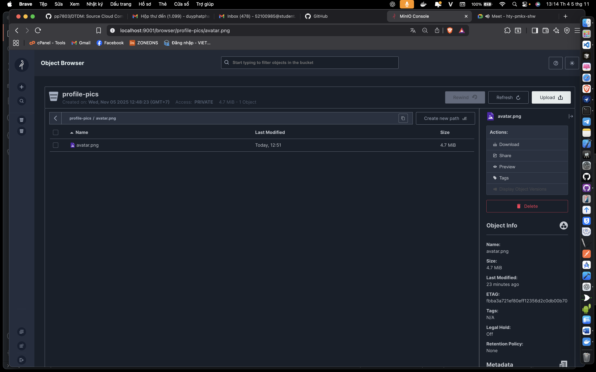
_Upload ảnh đại diện vào bucket_

**3. Tạo bucket `documents` và upload PDF:**

Làm tương tự với bucket `documents` và upload file `report.pdf`.

---

#### 🔐 Bước 2: Quản Lý Access Control qua MinIO Client

**MinIO từ v24+ đã ẩn GUI để set bucket policy.** Phải dùng **MinIO Client (mc)** qua command line.

##### Option 1: Dùng Docker Container (không cần cài mc)

**Set Bucket to PUBLIC (download only):**

```bash
docker run --rm --network cloud-net \
  --entrypoint /bin/sh \
  minio/mc -c "
    mc alias set minicloud http://object-storage-server:9000 minioadmin minioadmin && \
    mc anonymous set download minicloud/profile-pics && \
    mc anonymous get minicloud/profile-pics
  "
```

**Output:**

```
Added `minicloud` successfully.
Access permission for `minicloud/profile-pics` is set to `download`
Access permission for `minicloud/profile-pics` is `download`
```

**Set Bucket to PRIVATE:**

```bash
docker run --rm --network cloud-net \
  --entrypoint /bin/sh \
  minio/mc -c "
    mc alias set minicloud http://object-storage-server:9000 minioadmin minioadmin && \
    mc anonymous set none minicloud/profile-pics && \
    mc anonymous get minicloud/profile-pics
  "
```

**Output:**

```
Added `minicloud` successfully.
Access permission for `minicloud/profile-pics` is set to `none`
Access permission for `minicloud/profile-pics` is `none`
```

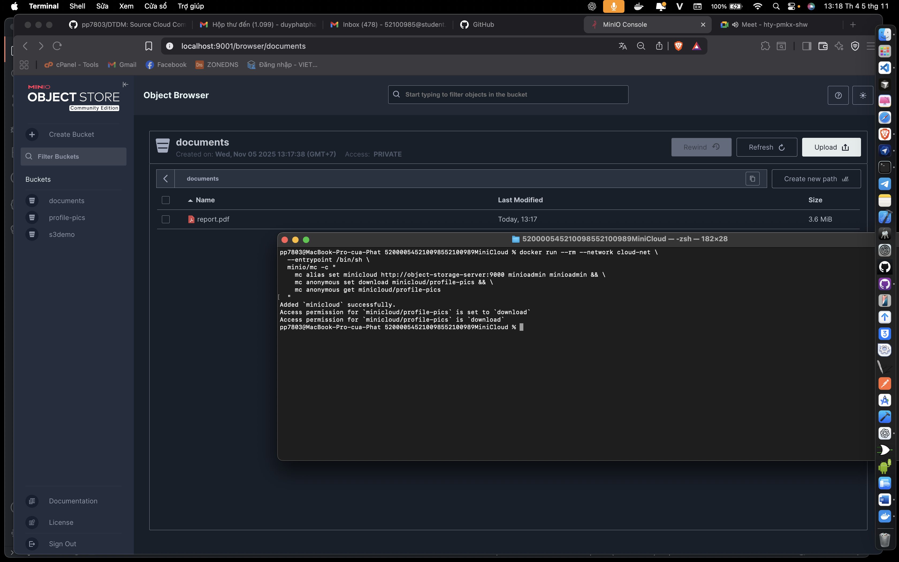
_Set bucket policy (Public) qua MinIO Client_

#### 🔓 Bước 3: Test Public vs Private Access

**1. Khi bucket là PUBLIC (download policy):**

```bash
# Lấy public URL
echo "http://localhost:9000/profile-pics/avatar.png"

# Test access WITHOUT authentication (should work ✅)
curl -I http://localhost:9000/profile-pics/avatar.png

# Expected: HTTP/1.1 200 OK
```

**Response:**

```
HTTP/1.1 200 OK
Content-Type: image/jpeg
Content-Length: 245678
ETag: "abc123def456"
Last-Modified: Mon, 04 Nov 2025 20:30:00 GMT
```

**Mở trong browser (should work):**

```bash
open http://localhost:9000/profile-pics/avatar.png
```


_Truy cập public URL thành công_

---

**2. Khi bucket là PRIVATE (none policy):**

```bash
# Test access WITHOUT authentication (should fail ❌)
curl -I http://localhost:9000/profile-pics/avatar.png

# Expected: HTTP/1.1 403 Forbidden
```

**Response:**

```xml
HTTP/1.1 403 Forbidden
<?xml version="1.0" encoding="UTF-8"?>
<Error>
  <Code>AccessDenied</Code>
  <Message>Access Denied</Message>
  <Resource>/profile-pics/avatar.jpg</Resource>
</Error>
```

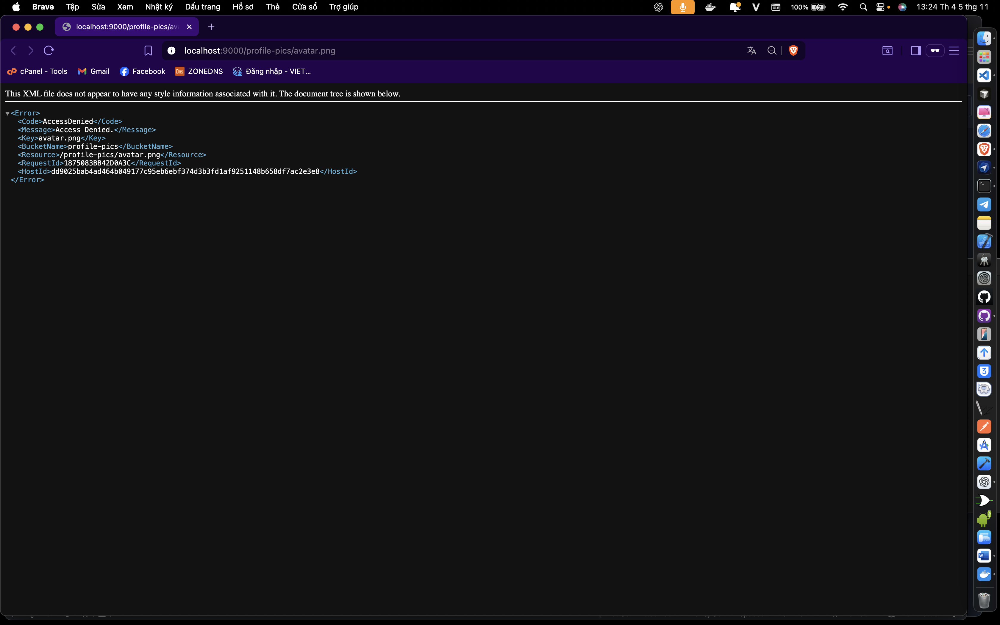
_Access bị từ chối với private bucket_

---

#### 📦 Bước 5: Quản Lý Bucket `documents`

**Set policy cho bucket documents:**

```bash
# Set public
docker run --rm --network cloud-net \
  --entrypoint /bin/sh \
  minio/mc -c "
    mc alias set minicloud http://object-storage-server:9000 minioadmin minioadmin && \
    mc anonymous set download minicloud/documents && \
    mc ls minicloud/documents
  "

# Test URL
curl -I http://localhost:9000/documents/report.pdf
```

**List all files trong bucket:**

```bash
docker run --rm --network cloud-net \
  --entrypoint /bin/sh \
  minio/mc -c "
    mc alias set minicloud http://object-storage-server:9000 minioadmin minioadmin && \
    mc ls minicloud/profile-pics && \
    mc ls minicloud/documents
  "
```

---

#### 🎓 Kiến Thức Đạt Được

✅ **MinIO Architecture:** Hiểu phân biệt API port (9000) vs Console port (9001)

✅ **Bucket Concept:** Object storage container tương tự AWS S3 buckets

✅ **Access Policies:** Private (`none`), Public Read (`download`), Public Write (`upload`), Full Public (`public`)

✅ **MinIO Client (mc):** Command-line tool để quản lý buckets và objects

✅ **Object URLs:** Direct access URLs với format `http://endpoint:9000/bucket/object`

✅ **Anonymous Access:** Public access không cần authentication

✅ **GUI Limitations:** Từ MinIO v24+, phải dùng CLI để set bucket policies

#### 📊 MinIO Policy Levels

| Policy     | Read | Write | Use Case                                    |
| ---------- | ---- | ----- | ------------------------------------------- |
| `none`     | ❌   | ❌    | Private (default) - chỉ authenticated users |
| `download` | ✅   | ❌    | Public read-only (static assets, CDN)       |
| `upload`   | ❌   | ✅    | Public write-only (form uploads)            |
| `public`   | ✅   | ✅    | Full public (không khuyến khích)            |

**Best practice:**

- **Development:** `download` (public read)
- **Production:** `none` + pre-signed URLs với expiration

#### 🔄 Why Port 9000 (not 9001)?

**Analogy với Database:**

```
MySQL Workbench (GUI)     ←→  MinIO Console (port 9001)
MySQL Server (API)        ←→  MinIO API Server (port 9000)

Applications connect to:  MySQL port 3306  →  MinIO port 9000
```

**MinIO Client (`mc`) là CLI tool** - nó kết nối tới **API server (port 9000)**, không phải Web Console (port 9001).

**MinIO v24+ Changes:**

- Trước v24: Có thể set bucket policy qua GUI (Console)
- Từ v24+: **Tính năng set policy qua GUI đã bị ẩn/loại bỏ**
- Lý do: MinIO muốn khuyến khích dùng IaC (Infrastructure as Code) và automation

---

### 6️⃣ Internal DNS Server - BIND9 Custom DNS Records

**Mục tiêu:** Hiểu về phân giải tên miền nội bộ (internal DNS resolution) trong cloud environment.

#### 📝 Nội Dung Mở Rộng

Thêm **custom DNS records** cho các services trong zone `db.cloud.local` để các containers có thể resolve domain names thay vì dùng IP addresses.

#### 🗂️ DNS Zone File Structure

**File location:** `internal-dns-server/db.cloud.local`

**Current zone file có cấu trúc:**

```dns
$TTL    604800
@       IN      SOA     dns.cloud.local. admin.cloud.local. (
                              2         ; Serial
                         604800         ; Refresh
                          86400         ; Retry
                        2419200         ; Expire
                         604800 )       ; Negative Cache TTL
;
@       IN      NS      dns.cloud.local.
dns     IN      A       10.10.10.53

; Existing records
web-frontend-server     IN      A       10.10.10.10
```

---

#### ✏️ Bước 1: Thêm DNS Records Mới

**1. Mở file zone:**

```bash
cd 520000545210098552100989MiniCloud/internal-dns-server
nano db.cloud.local
```

**2. Thêm các bản ghi sau vào cuối file:**

```dns
; Application Backend Server
app-backend.cloud.local.        IN      A       10.10.10.20

; Object Storage Server
minio.cloud.local.              IN      A       10.10.10.30

; Authentication Server
keycloak.cloud.local.           IN      A       10.10.10.40
```

**3. Update Serial number (quan trọng!):**

Mỗi lần sửa zone file, **phải tăng Serial number** để BIND reload cấu hình:

```dns
@       IN      SOA     dns.cloud.local. admin.cloud.local. (
                              3         ; Serial (tăng từ 2 → 3)
                         604800         ; Refresh
                          86400         ; Retry
                        2419200         ; Expire
                         604800 )       ; Negative Cache TTL
```

**4. Full zone file sau khi edit:**

```dns
$TTL    604800
@       IN      SOA     dns.cloud.local. admin.cloud.local. (
                              3         ; Serial (updated!)
                         604800         ; Refresh
                          86400         ; Retry
                        2419200         ; Expire
                         604800 )       ; Negative Cache TTL
;
@       IN      NS      dns.cloud.local.
dns     IN      A       10.10.10.53

; Web Frontend
web-frontend-server     IN      A       10.10.10.10

; Application Backend Server (NEW)
app-backend.cloud.local.        IN      A       10.10.10.20

; Object Storage Server (NEW)
minio.cloud.local.              IN      A       10.10.10.30

; Authentication Server (NEW)
keycloak.cloud.local.           IN      A       10.10.10.40
```

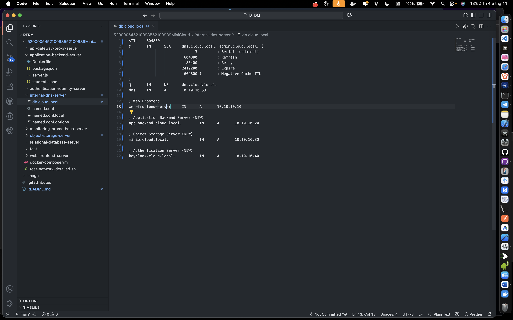
_Thêm DNS records vào zone file_

---

#### 🔄 Bước 2: Restart DNS Container

**1. Restart để apply changes:**

```bash
cd 520000545210098552100989MiniCloud
docker compose restart internal-dns-server
```

**2. Check logs để verify reload thành công:**

```bash
docker compose logs internal-dns-server | tail -20
```

**Expected output:**

```
internal-dns-server-1  | zone cloud.local/IN: loaded serial 3
internal-dns-server-1  | zone cloud.local/IN: sending notifies (serial 3)
```

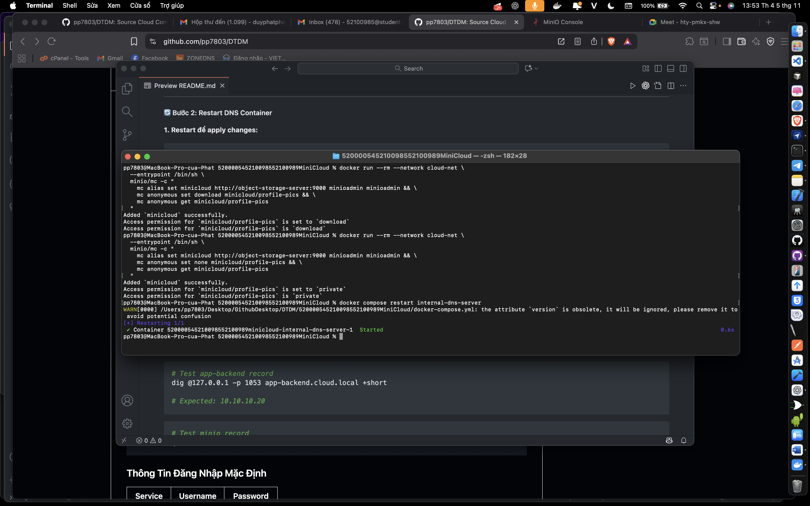
_Restart DNS container thành công_

---

#### 🧪 Bước 3: Test DNS Resolution

**1. Test với `dig` command:**

```bash
# Test app-backend record
dig @127.0.0.1 -p 1053 app-backend.cloud.local +short

# Expected: 10.10.10.20
```

```bash
# Test minio record
dig @127.0.0.1 -p 1053 minio.cloud.local +short

# Expected: 10.10.10.30
```

```bash
# Test keycloak record
dig @127.0.0.1 -p 1053 keycloak.cloud.local +short

# Expected: 10.10.10.40
```

**2. Test all records:**

```bash
# Test tất cả records trong một command
for domain in app-backend.cloud.local minio.cloud.local keycloak.cloud.local; do
  echo "Testing $domain:"
  dig @127.0.0.1 -p 1053 $domain +short
  echo ""
done
```

**Expected output:**

```
Testing app-backend.cloud.local:
10.10.10.20

Testing minio.cloud.local:
10.10.10.30

Testing keycloak.cloud.local:
10.10.10.40
```

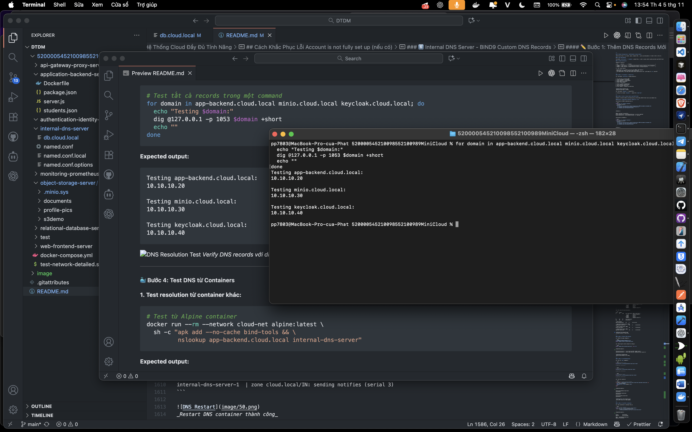
_Verify DNS records với dig command_

---

#### 🐳 Bước 4: Test DNS từ Containers

**1. Test resolution từ container khác:**

```bash
# Test từ Alpine container
docker run --rm --network cloud-net alpine:latest \
  sh -c "apk add --no-cache bind-tools && \
         nslookup app-backend.cloud.local internal-dns-server"
```

**Expected output:**

```
Server:         10.10.10.53
Address:        10.10.10.53#53

Name:   app-backend.cloud.local
Address: 10.10.10.20
```

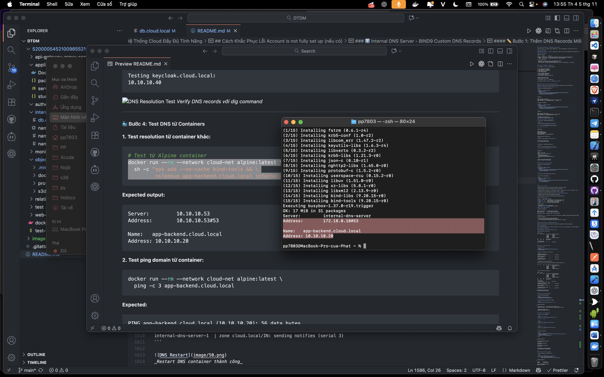
_Test DNS resolution từ container_

**2. Test ping với Docker service names:**

```bash
# Alpine containers không tự động dùng custom DNS
# Nên dùng Docker service names (được Docker DNS resolve tự động)
docker run --rm --network cloud-net alpine:latest \
  ping -c 3 application-backend-server
```

**Expected:**

```
PING application-backend-server (172.18.0.5): 56 data bytes
64 bytes from 172.18.0.5: seq=0 ttl=64 time=0.123 ms
64 bytes from 172.18.0.5: seq=1 ttl=64 time=0.098 ms
64 bytes from 172.18.0.5: seq=2 ttl=64 time=0.105 ms
```

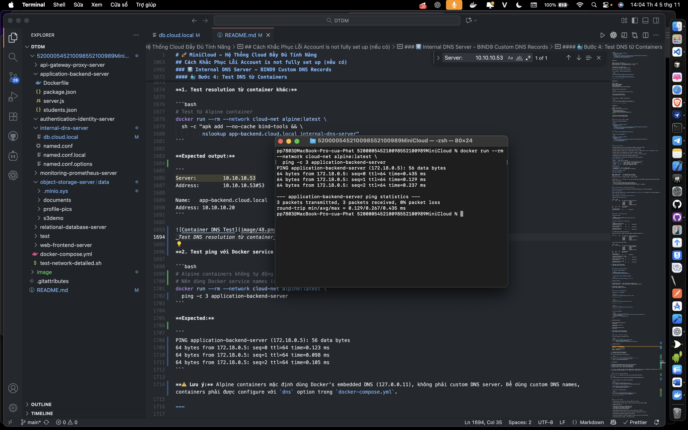
_Test ping với Docker service names_

**⚠️ Lưu ý:** Alpine containers mặc định dùng Docker's embedded DNS (127.0.0.11), không phải custom DNS server. Để dùng custom DNS names, containers phải được configure với `dns` option trong `docker-compose.yml`.

---

#### 🔍 Bước 5: Verify DNS Integration

**1. Test containers có thể resolve nhau qua DNS:**

```bash
# Backend container resolve MinIO
docker compose exec application-backend-server \
  sh -c "apk add --no-cache bind-tools && nslookup minio.cloud.local"

# Backend container resolve Keycloak
docker compose exec application-backend-server \
  sh -c "nslookup keycloak.cloud.local"
```

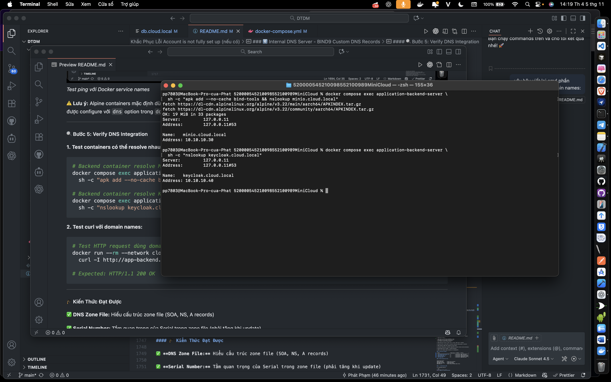
_Test containers có thể resolve nhau qua DNS_

**2. Test curl với domain names:**

```bash
# Test HTTP request dùng domain name thay vì IP
# Phải thêm --dns 10.10.10.53 để container sử dụng custom DNS
docker run --rm --network cloud-net --dns 10.10.10.53 \
  curlimages/curl:latest \
  curl -I http://app-backend.cloud.local:8081/hello

# Expected: HTTP/1.1 200 OK
```

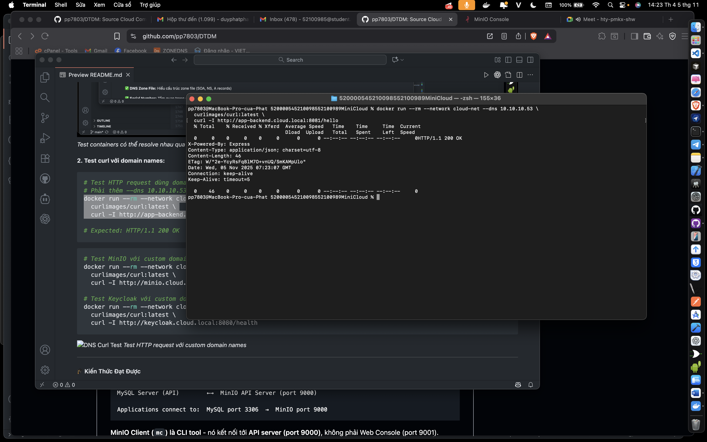
_Test HTTP request với custom domain names_

```bash
# Test MinIO với custom domain
docker run --rm --network cloud-net --dns 10.10.10.53 \
  curlimages/curl:latest \
  curl -I http://minio.cloud.local:9000/minio/health/live

# Test Keycloak với custom domain
docker run --rm --network cloud-net --dns 10.10.10.53 \
  curlimages/curl:latest \
  curl -I http://keycloak.cloud.local:8080/health
```

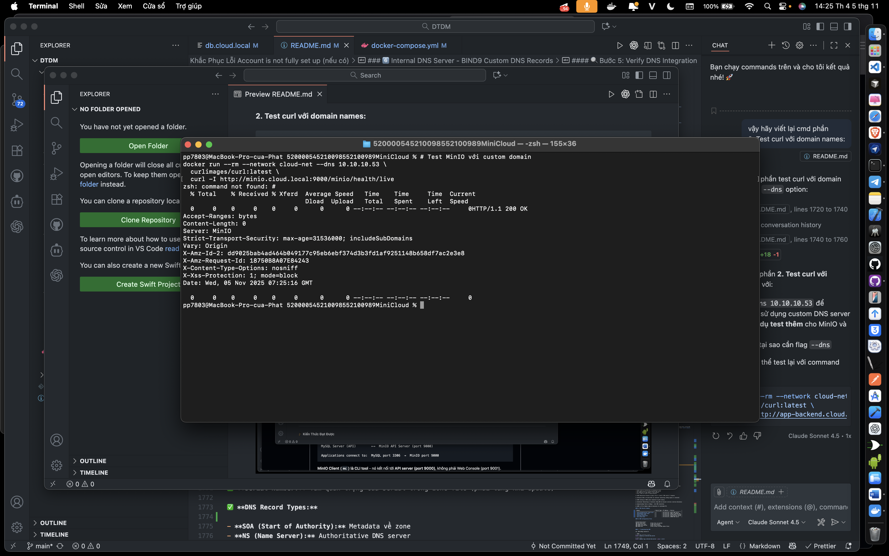
_Test MinIO với custom domain_

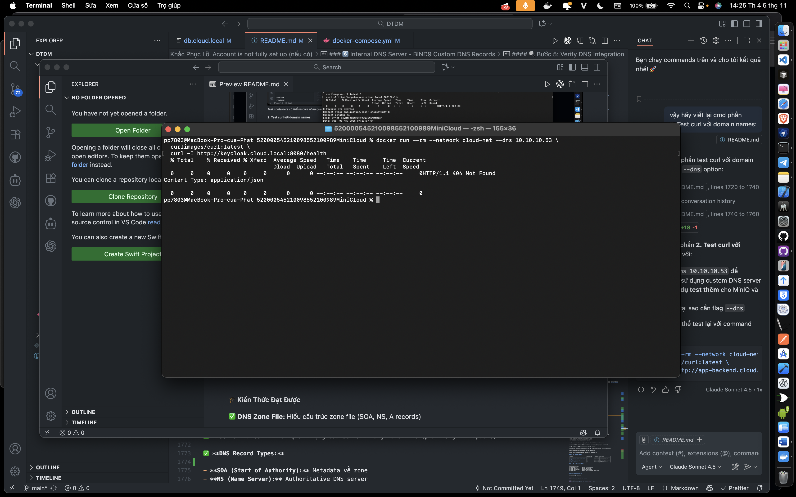
_Test Keycloak với custom domain_

---

#### 🎓 Kiến Thức Đạt Được

✅ **DNS Zone File:** Hiểu cấu trúc zone file (SOA, NS, A records)

✅ **Serial Number:** Tầm quan trọng của Serial trong zone file (phải tăng khi update)

✅ **DNS Record Types:**

- **SOA (Start of Authority):** Metadata về zone
- **NS (Name Server):** Authoritative DNS server
- **A (Address):** Map domain → IPv4 address
- **TTL (Time To Live):** Cache duration

✅ **DNS Resolution Process:** Query flow từ client → DNS server → response

✅ **Internal DNS:** Private DNS cho container networking (không expose ra internet)

✅ **DNS Caching:** BIND cache responses để giảm latency

✅ **Container Networking:** Containers dùng DNS để discover services (service discovery)

✅ **dig/nslookup Tools:** Debug và test DNS resolution

✅ **DNS vs IP:** Domain names dễ maintain hơn hardcoded IPs

#### 📊 DNS Records Summary

| Domain                            | Record Type | IP Address  | Service              |
| --------------------------------- | ----------- | ----------- | -------------------- |
| `web-frontend-server.cloud.local` | A           | 10.10.10.10 | Nginx Web Server     |
| `app-backend.cloud.local`         | A           | 10.10.10.20 | Node.js Backend API  |
| `minio.cloud.local`               | A           | 10.10.10.30 | MinIO Object Storage |
| `keycloak.cloud.local`            | A           | 10.10.10.40 | Keycloak Auth Server |
| `dns.cloud.local`                 | A           | 10.10.10.53 | BIND9 DNS Server     |

#### 🔧 DNS Configuration Files

```
internal-dns-server/
├── db.cloud.local          # Zone file (A records)
├── named.conf.local        # Zone declaration
├── named.conf.options      # DNS server options
└── named.conf              # Main config (includes above files)
```

#### 🛠️ Troubleshooting DNS

**1. DNS không resolve:**

```bash
# Check DNS container status
docker compose ps internal-dns-server

# Check logs
docker compose logs internal-dns-server | grep -i error

# Restart DNS
docker compose restart internal-dns-server
```

**2. Serial number không tăng:**

```bash
# Check current serial
dig @127.0.0.1 -p 1053 cloud.local SOA

# Output shows current serial number
```

**3. Verify zone file syntax:**

```bash
# Enter DNS container
docker compose exec internal-dns-server sh

# Check zone syntax
named-checkzone cloud.local /etc/bind/db.cloud.local

# Should output: "OK" if no errors
```

**4. Cache issues:**

```bash
# Flush DNS cache trong container
docker compose exec internal-dns-server rndc flush

# Hoặc restart DNS server
docker compose restart internal-dns-server
```

#### 💡 Best Practices

**1. Always update Serial when editing zone file:**

```dns
; Good practice: Use YYYYMMDDNN format
Serial: 2025110401  (2025-11-04, version 01)
```

**2. Use FQDN (Fully Qualified Domain Names):**

```dns
; Good (with trailing dot)
app-backend.cloud.local.    IN      A       10.10.10.20

; Also works (without dot - BIND adds zone automatically)
app-backend                 IN      A       10.10.10.20
```

**3. Consistent naming convention:**

```
[service-name].cloud.local
web-frontend.cloud.local
app-backend.cloud.local
minio.cloud.local
```

**4. Document IP assignments:**

```
10.10.10.10-19  → Web/Frontend services
10.10.10.20-29  → Backend/API services
10.10.10.30-39  → Storage services
10.10.10.40-49  → Auth services
10.10.10.50-59  → Infrastructure (DNS, monitoring)
```

---

### 7️⃣ Monitoring Prometheus - Web Frontend Metrics

**Mục tiêu:** Nắm vững nguyên tắc giám sát metrics và scrape target với Prometheus.

#### 📝 Nội Dung Mở Rộng

Thêm **target mới** để giám sát web-frontend-server bằng cách sử dụng **Nginx Prometheus Exporter**.

#### 🏗️ Kiến Trúc Monitoring

```
┌─────────────────────┐
│  Web Frontend (80)  │
│     Nginx Server    │
│  /stub_status       │
└──────────┬──────────┘
           │
           │ scrape stub_status
           ▼
┌─────────────────────┐
│  Nginx Exporter     │
│   (Port 9113)       │
│  /metrics           │
└──────────┬──────────┘
           │
           │ scrape metrics
           ▼
┌─────────────────────┐
│   Prometheus        │
│   (Port 9090)       │
│  Time Series DB     │
└─────────────────────┘
```

---

#### 🔧 Bước 1: Enable Nginx Stub Status

**1. Update `web-frontend-server/conf.default`:**

```nginx
server {
  listen 80;
  server_name _;

  root /usr/share/nginx/html;
  index index.html;

  location / { try_files $uri $uri/ =404; }
  location ^~ /blog/ {
    alias /usr/share/nginx/html/blog/;
    index index.html;
    autoindex off;
  }

  # Stub status endpoint for Prometheus metrics
  location /stub_status {
    stub_status;
    allow 10.10.10.0/24;  # Only internal network
    deny all;
  }
}
```

**Giải thích:**

- **`stub_status`**: Module của Nginx để expose basic metrics
- **`allow 10.10.10.0/24`**: Chỉ cho phép truy cập từ internal network
- **`deny all`**: Chặn tất cả requests từ bên ngoài

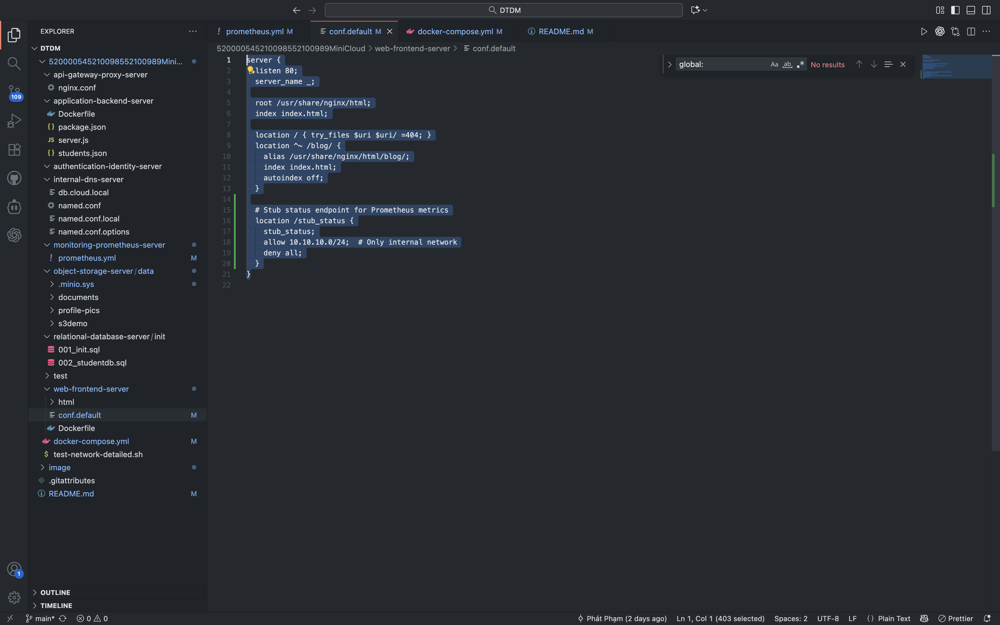
_Cấu hình stub_status endpoint_

---

#### 🐳 Bước 2: Add Nginx Exporter Container

**1. Update `docker-compose.yml` - thêm service mới:**

```yaml
nginx-exporter:
  image: nginx/nginx-prometheus-exporter:latest
  command:
    - "-nginx.scrape-uri=http://web-frontend-server:80/stub_status"
  ports: ["9113:9113"]
  networks:
    - cloud-net
  dns:
    - 10.10.10.53
    - 8.8.8.8
  depends_on:
    - web-frontend-server
  restart: unless-stopped
```

**Giải thích:**

- **Image**: Official Nginx Prometheus Exporter từ Nginx team
- **Command**: URL tới stub_status endpoint của Nginx
- **Port 9113**: Exporter expose metrics ở port này
- **depends_on**: Đảm bảo web-frontend-server start trước

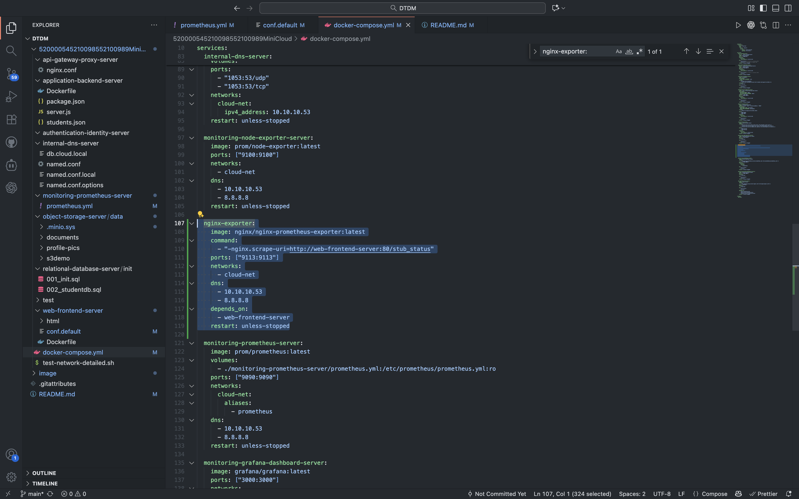
_Thêm nginx-exporter service_

---

#### 📊 Bước 3: Update Prometheus Configuration

**1. Update `monitoring-prometheus-server/prometheus.yml`:**

```yaml
global:
  scrape_interval: 15s
  evaluation_interval: 15s

scrape_configs:
  - job_name: "prometheus"
    static_configs:
      - targets: ["localhost:9090"]

  - job_name: "node"
    static_configs:
      - targets: ["monitoring-node-exporter-server:9100"]

  - job_name: "web"
    static_configs:
      - targets: ["nginx-exporter:9113"]
```

**Giải thích:**

- **job_name: 'web'**: Tên job để nhận diện trong Prometheus UI
- **targets**: DNS name và port của nginx-exporter
- **scrape_interval**: Prometheus sẽ scrape metrics mỗi 15 giây

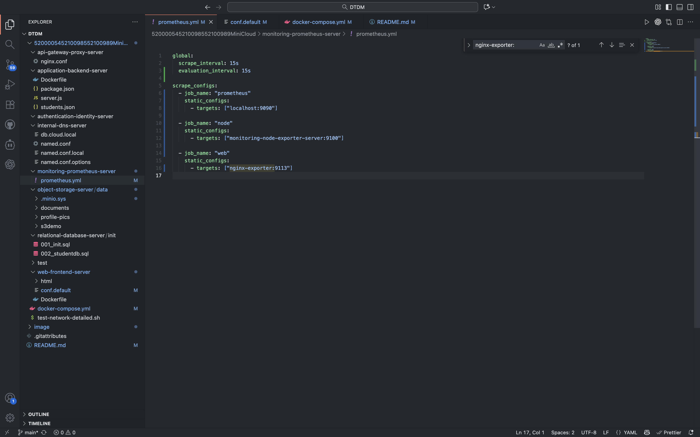
_Cấu hình Prometheus với job 'web'_

---

#### 🚀 Bước 4: Deploy và Verify

**1. Rebuild web-frontend-server:**

```bash
cd 520000545210098552100989MiniCloud

# Rebuild với cấu hình mới
docker compose build web-frontend-server

# Restart containers
docker compose up -d
```

**2. Verify nginx-exporter:**

```bash
# Check container status
docker compose ps nginx-exporter

# Check logs
docker compose logs -f nginx-exporter
```

**Expected logs:**

```
nginx-exporter-1  | Server is starting...
nginx-exporter-1  | Listening on :9113
```

**3. Test stub_status endpoint:**

```bash
# Test từ host machine (sẽ bị 403 Forbidden - đúng như expected)
curl http://localhost:8080/stub_status
# Output: 403 Forbidden (chỉ cho phép internal network)

# Test từ internal network (dùng temporary container)
docker run --rm --network cloud-net curlimages/curl:latest \
  curl -s http://web-frontend-server:80/stub_status
```

**Expected output khi test từ internal network:**

```
Active connections: 2
server accepts handled requests
 34 34 2307
Reading: 0 Writing: 1 Waiting: 1
```

**Giải thích:**

- Từ host machine (localhost:8080): **403 Forbidden** - vì chỉ cho phép internal network (10.10.10.0/24)
- Từ container trong cloud-net: **200 OK** - vì IP thuộc 10.10.10.0/24

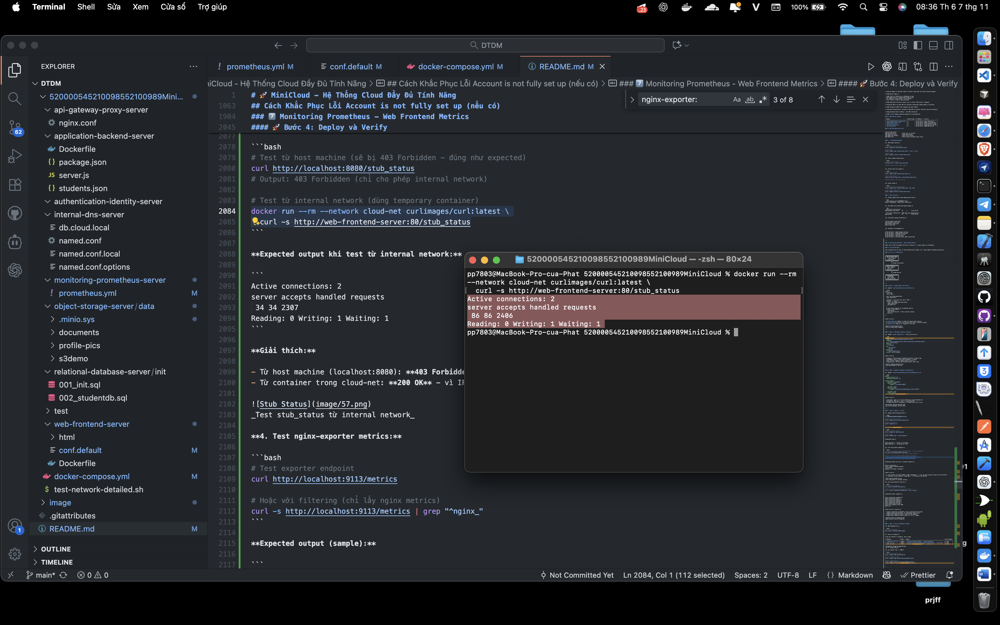
_Test stub_status từ internal network_

**4. Test nginx-exporter metrics:**

```bash
# Test exporter endpoint
curl http://localhost:9113/metrics

# Hoặc với filtering (chỉ lấy nginx metrics)
curl -s http://localhost:9113/metrics | grep "^nginx_"
```

**Expected output (sample):**

```
nginx_connections_accepted 34
nginx_connections_active 1
nginx_connections_handled 34
nginx_connections_reading 0
nginx_connections_waiting 0
nginx_connections_writing 1
nginx_http_requests_total 2309
nginx_up 1
```

**Giải thích các metrics:**

- **nginx_connections_accepted**: Tổng số connections đã accept
- **nginx_connections_active**: Số connections đang active
- **nginx_http_requests_total**: Tổng số HTTP requests
- **nginx_up**: Exporter health status (1 = UP, 0 = DOWN)

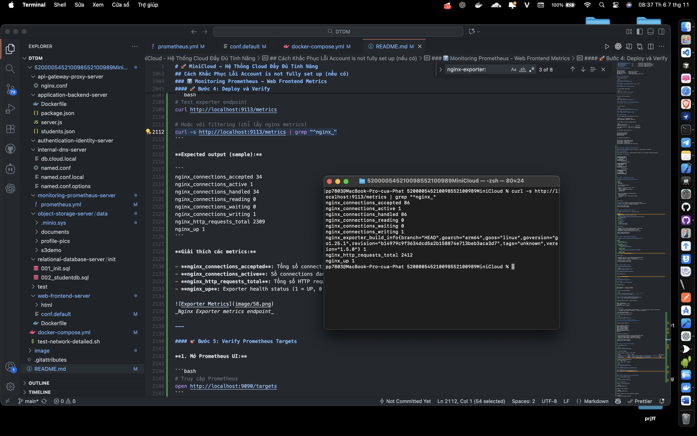
_Nginx Exporter metrics endpoint_

---

#### 🎯 Bước 5: Verify Prometheus Targets

**1. Mở Prometheus UI:**

```bash
# Truy cập Prometheus
open http://localhost:9090/targets
```

**2. Kiểm tra targets:**

Trong tab **Status → Targets**, bạn sẽ thấy:

| Endpoint              | State  | Labels                                                          | Last Scrape |
| --------------------- | ------ | --------------------------------------------------------------- | ----------- |
| `prometheus (1/1 up)` | **UP** | `instance="localhost:9090"`, `job="prometheus"`                 | 2s ago      |
| `node (1/1 up)`       | **UP** | `instance="monitoring-node-exporter-server:9100"`, `job="node"` | 5s ago      |
| `web (1/1 up)`        | **UP** | `instance="nginx-exporter:9113"`, `job="web"`                   | 3s ago      |

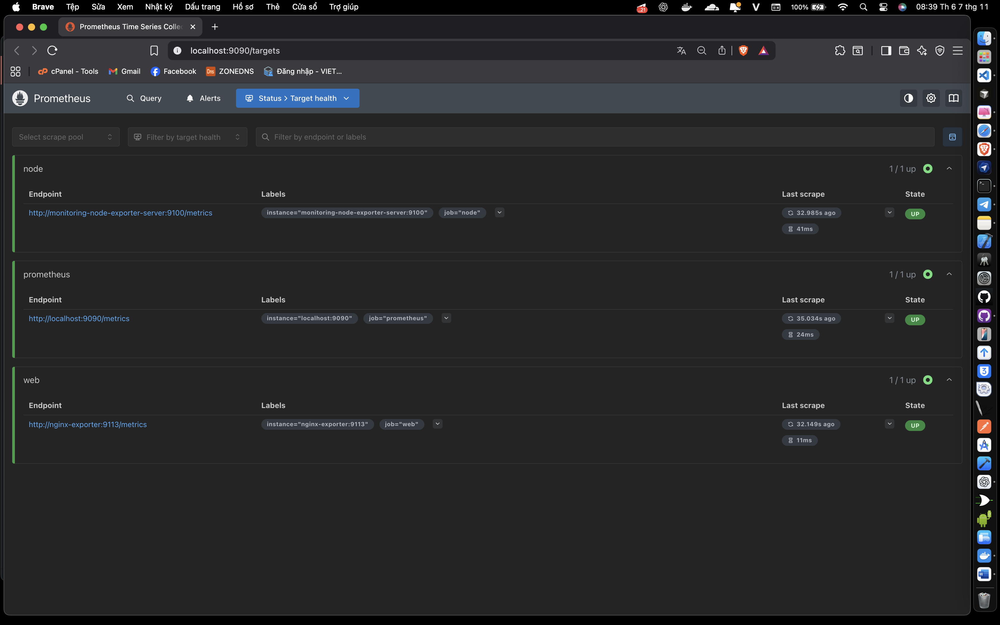
_Tất cả targets đều UP_

**3. Nếu target 'web' là DOWN:**

```bash
# Check nginx-exporter logs
docker compose logs nginx-exporter

# Check Prometheus logs
docker compose logs monitoring-prometheus-server

# Verify connectivity
docker compose exec monitoring-prometheus-server \
  sh -c "wget -O- http://nginx-exporter:9113/metrics"
```

---

#### 📈 Bước 6: Query Nginx Metrics trong Prometheus

**1. Truy cập Prometheus Graph:**

```bash
open http://localhost:9090/graph
```

**2. Thử các queries:**

**Query 1: Active connections**

```promql
nginx_connections_active
```

**Query 2: Total requests**

```promql
nginx_http_requests_total
```

**Query 3: Requests per second (rate over 1 minute)**

```promql
rate(nginx_http_requests_total[1m])
```

**Query 4: Connection acceptance rate**

```promql
rate(nginx_connections_accepted[5m])
```

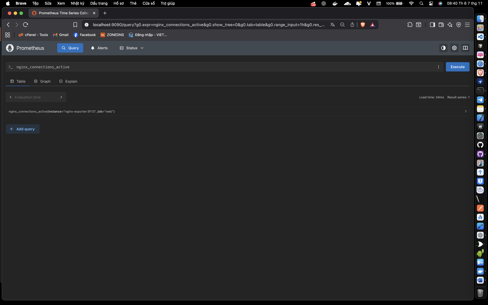
_Query Nginx metrics trong Prometheus_

**3. Test queries qua API:**

```bash
# Query nginx_up
curl -s 'http://localhost:9090/api/v1/query?query=nginx_up' | python3 -m json.tool

# Query total requests
curl -s 'http://localhost:9090/api/v1/query?query=nginx_http_requests_total' | python3 -m json.tool

# Query rate (escape brackets trong shell)
curl -s 'http://localhost:9090/api/v1/query?query=rate(nginx_http_requests_total\[1m\])'
```

**4. Generate traffic để xem metrics thay đổi:**

```bash
# Gửi 50 requests
echo "Generating traffic..." && \
for i in {1..50}; do curl -s http://localhost:8080/ > /dev/null; done && \
echo "Done! Sent 50 requests"

# Wait và xem metrics update
sleep 5
curl -s 'http://localhost:9090/api/v1/query?query=nginx_http_requests_total'

# Xem metrics từ exporter
curl -s http://localhost:9113/metrics | grep "^nginx_http_requests_total"
```

**Expected:**

- Metrics sẽ tăng từ giá trị cũ + 50 requests
- Rate sẽ hiển thị requests/second (~0.8-1.0 req/s)

---

#### 🎓 Kiến Thức Đạt Được

✅ **Prometheus Scrape Configs:** Hiểu cách cấu hình targets và jobs

✅ **Job Name:** Tên để nhận diện và group targets trong Prometheus

✅ **Metrics Endpoint:** Services expose metrics tại `/metrics` endpoint (Prometheus format)

✅ **Exporter Pattern:** Sử dụng exporter để convert metrics từ app → Prometheus format

✅ **Nginx Stub Status:** Module tích hợp sẵn của Nginx để expose basic metrics

✅ **Time Series Data:** Prometheus lưu metrics theo thời gian (timestamp + value)

✅ **PromQL:** Query language để truy vấn và aggregate metrics

✅ **Rate Function:** Tính toán rate of change (requests/second, connections/second)

✅ **Pull Model:** Prometheus chủ động pull metrics từ targets (không phải push)

✅ **Service Discovery:** Tự động discover targets trong Docker network

#### 📊 Nginx Metrics Available

| Metric Name                  | Type    | Description                  |
| ---------------------------- | ------- | ---------------------------- |
| `nginx_connections_active`   | Gauge   | Active client connections    |
| `nginx_connections_accepted` | Counter | Total accepted connections   |
| `nginx_connections_handled`  | Counter | Total handled connections    |
| `nginx_http_requests_total`  | Counter | Total HTTP requests          |
| `nginx_connections_reading`  | Gauge   | Connections reading request  |
| `nginx_connections_writing`  | Gauge   | Connections writing response |
| `nginx_connections_waiting`  | Gauge   | Idle keepalive connections   |

#### 🔍 Prometheus Architecture

```
┌──────────────────────────────────────────────────────┐
│                   Prometheus Server                  │
│                                                      │
│  ┌────────────┐    ┌──────────────┐   ┌──────────┐   │
│  │  Scraper   │───▶│  TSDB        │──▶│  Query   │   │
│  │  (Pull)    │    │  (Storage)   │   │  Engine  │   │
│  └────────────┘    └──────────────┘   └──────────┘   │
│         ▲                                     │      │
└─────────┼─────────────────────────────────────┼──────┘
          │                                     │
          │ scrape /metrics                     ▼
          │                              ┌─────────────┐
    ┌─────┴──────┐                       │   Grafana   │
    │  Targets:  │                       │ Visualization│
    │            │                       └─────────────┘
    │ • node:9100│
    │ • nginx:9113│
    │ • prom:9090 │
    └────────────┘
```

#### 🛠️ Troubleshooting

**1. Target DOWN:**

```bash
# Check exporter is running
docker compose ps nginx-exporter

# Check exporter logs
docker compose logs nginx-exporter

# Test connectivity from Prometheus container
docker compose exec monitoring-prometheus-server \
  wget -O- http://nginx-exporter:9113/metrics
```

**2. No metrics visible:**

```bash
# Check Prometheus config syntax
docker compose exec monitoring-prometheus-server \
  promtool check config /etc/prometheus/prometheus.yml

# Reload Prometheus config
docker compose restart monitoring-prometheus-server
```

**3. Stub status 403 Forbidden:**

```bash
# Check Nginx config
docker compose exec web-frontend-server cat /etc/nginx/conf.d/default.conf

# Verify allow directive includes exporter IP
docker inspect nginx-exporter | grep IPAddress
```

#### 💡 Best Practices

**1. Metrics naming convention:**

```
<namespace>_<subsystem>_<name>_<unit>
nginx_http_requests_total
node_cpu_seconds_total
```

**2. Use labels for dimensions:**

```promql
nginx_http_requests_total{job="web", instance="nginx-exporter:9113"}
```

**3. Counter vs Gauge:**

- **Counter**: Chỉ tăng (requests, connections) - dùng `rate()` để tính tốc độ
- **Gauge**: Có thể tăng/giảm (active connections, memory usage)

**4. Retention and storage:**

```yaml
# Trong prometheus config (nếu cần custom)
global:
  scrape_interval: 15s
  evaluation_interval: 15s
storage:
  tsdb:
    retention.time: 15d # Keep data for 15 days
```

#### ✅ Kết Quả Kiểm Thử Thành Công

**1. Nginx Stub Status:**

```bash
# Từ internal network
$ docker run --rm --network cloud-net curlimages/curl:latest \
  curl -s http://web-frontend-server:80/stub_status

Active connections: 2
server accepts handled requests
 34 34 2307
Reading: 0 Writing: 1 Waiting: 1
```

**2. Nginx Exporter Metrics:**

```bash
$ curl -s http://localhost:9113/metrics | grep "^nginx_"

nginx_connections_accepted 34
nginx_connections_active 1
nginx_http_requests_total 2372
nginx_up 1
```

**3. Prometheus Targets:**

```bash
$ curl -s http://localhost:9090/api/v1/targets | grep '"job"'

"job": "node"     → health: "up"
"job": "prometheus" → health: "up"
"job": "web"      → health: "up"  ✅ NEW!
```

**4. Prometheus Query Results:**

```json
// Query: nginx_http_requests_total
{
  "metric": {
    "instance": "nginx-exporter:9113",
    "job": "web"
  },
  "value": [1762479022, "2372"]
}

// Query: rate(nginx_http_requests_total[1m])
{
  "value": [1762479022, "0.0666681481810707"]
}
// ≈ 0.067 requests/second (~4 requests/minute)
```

---

### Scripts Hữu Ích

**Script kiểm tra mạng chi tiết:**

```bash
./test-network-detailed.sh
```

**Xem logs của service cụ thể:**

```bash
docker compose logs -f [service-name]
```

**Restart một service:**

```bash
docker compose restart [service-name]
```

**Stop và cleanup:**

```bash
docker compose down -v
```

**Build lại images:**

```bash
docker compose build
```

**Khởi động tất cả services**

```bash
docker compose up -d
```

**Kiểm tra trạng thái**

```bash
docker compose ps
```

### Thông Tin Đăng Nhập Mặc Định

| Service  | Username   | Password   |
| -------- | ---------- | ---------- |
| Keycloak | admin      | admin      |
| MinIO    | minioadmin | minioadmin |
| Grafana  | admin      | admin      |
| MariaDB  | root       | root       |

---

## 👥 Nhóm Thực Hiện

- **52000054** - Nguyên Hạnh
- **52100985** - Duy Phát
- **52100989** - Văn Phú
